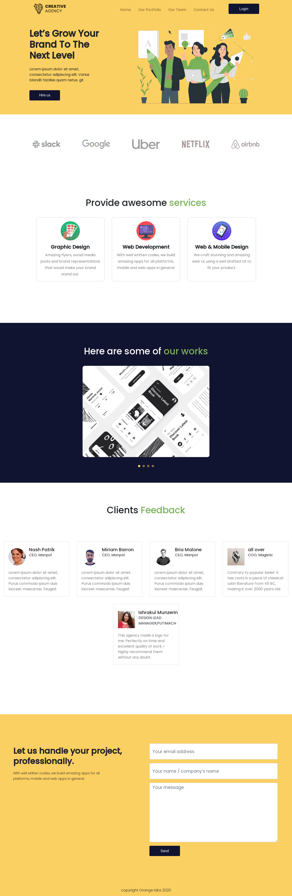
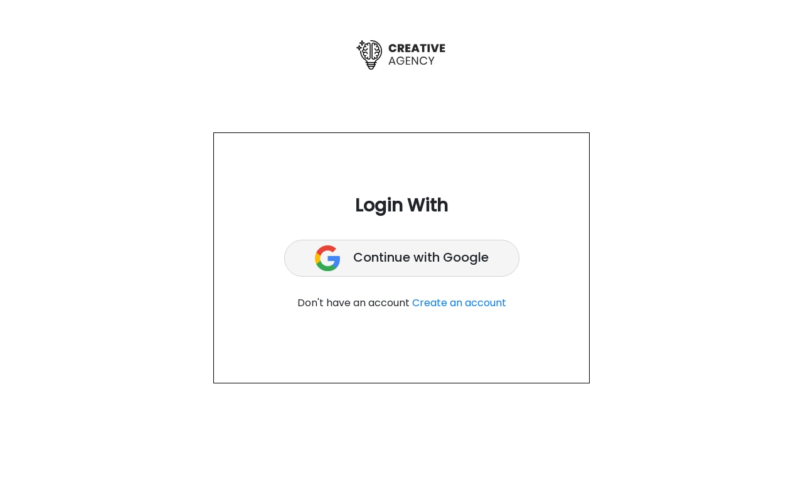
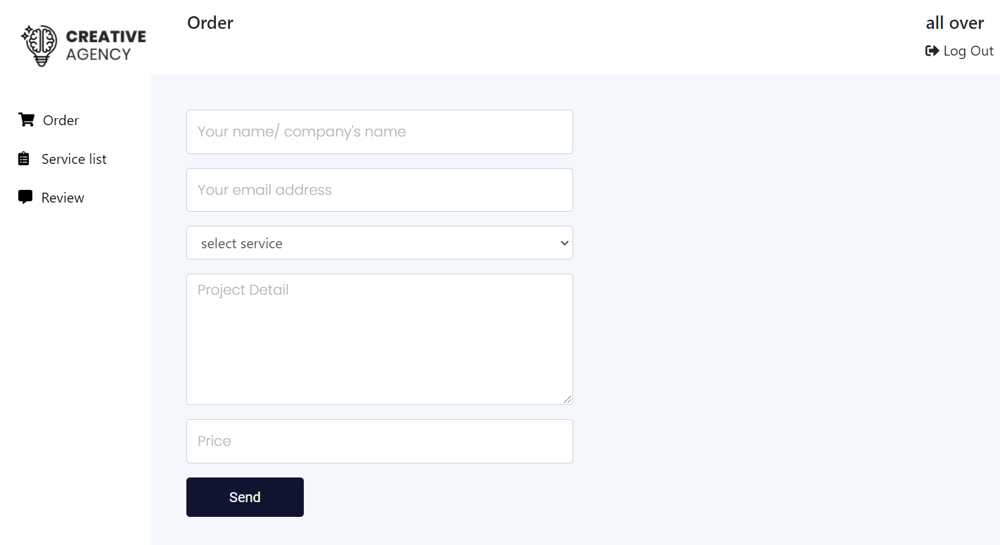
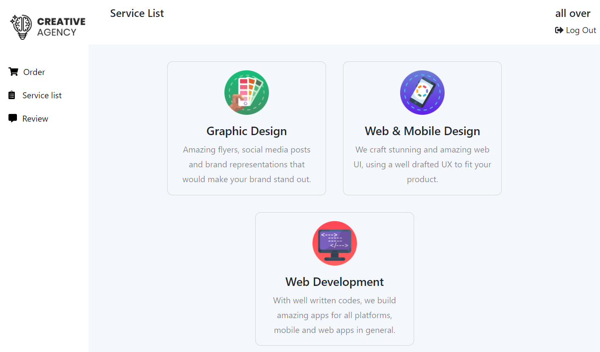
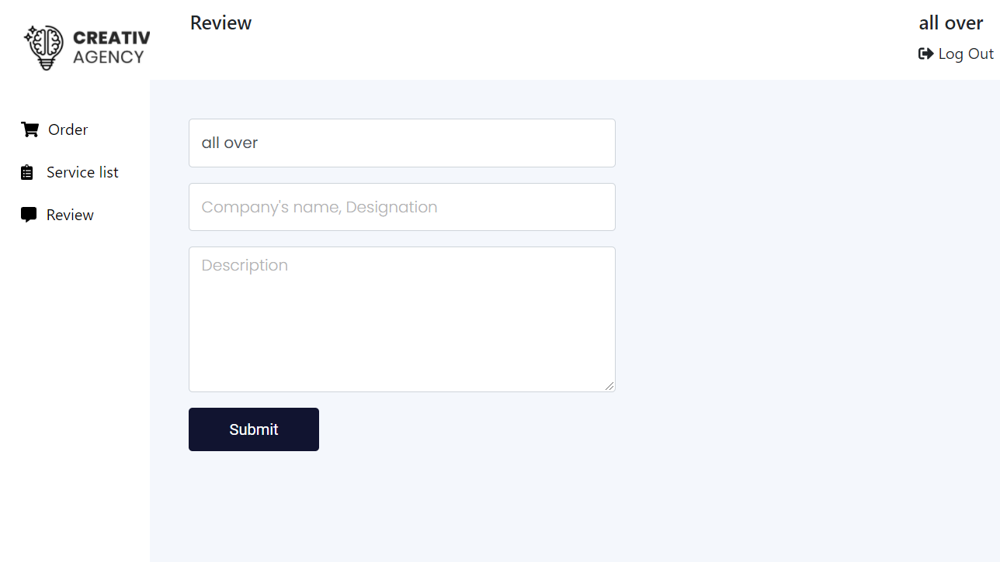
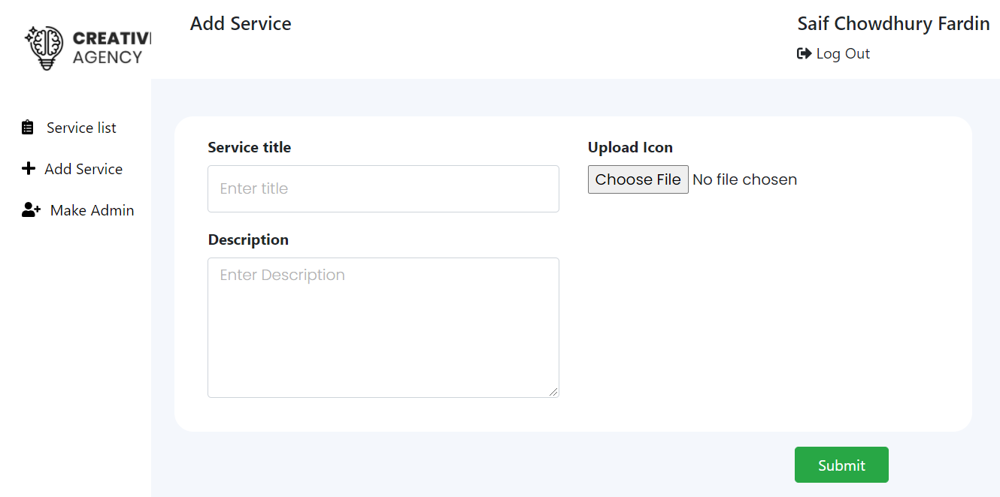
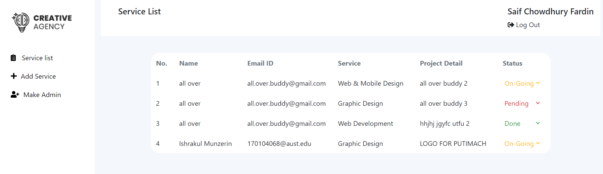
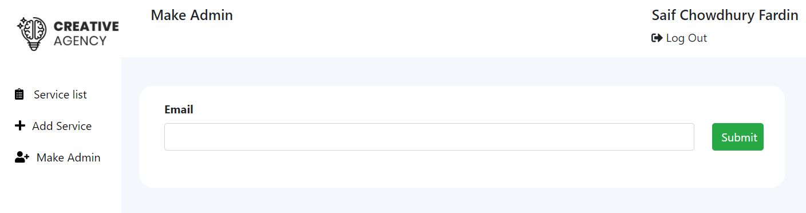

# creative-agency-client

A single page full-stack web application where variety of IT services are provided for it's users.

### `Key Features:`

1. A responsive landing page.
2. Separate dashboard for users and admins.
3. Login can be done via GOOGLE accounts.
4. Users can opt-in to various IT services.
5. Users can view all the services they have placed in their dashboard.
6. Users can put reviews for the services they had. Reviews of users are displayed over the _Clients Feedback_ section of _Landing Page_.
7. Admin can view all the orders put by every user in their dashboard.
8. Admin can update the STATUS of any order using their dashboard.
9. Admin can add new services for his users. These services will be shown in the _Landing Page_.
10. Admin can add further new admins.

### `Front-End Technologies:`

- React
- React Router
- Bootstrap
- Firebase Authentication
- Context API
- HTML5
- CSS3

### `Back-End Technologies:`

- Node.js
- Express.js
- MongoDB
- Heroku

---

[Visit Live Site](https://assignment-11-jm.web.app/)

[Visit Back-End Repository](https://github.com/saiffardin/creative-agency-server)

---

### `Screenshots:`

Landing Page : Desktop

---

Log In

---

Client - Order

---

Client - Service list

---

Client - Review

---

Admin - Add Service

---

Admin - Service list

---

Admin - Add Admin

